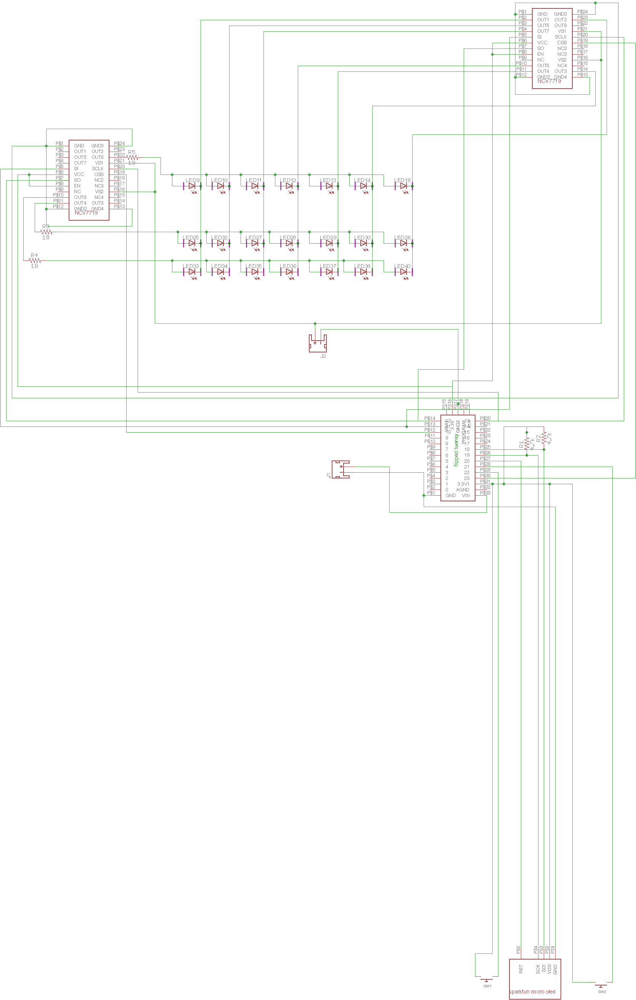

# Pattern Control
This project uses two NCV7719 chips combined with a Mirco OLED Breakout and Teensy 3.2 to control Nitinol covered in thermochromic paint. 
## About the Pattern Control 
This Aruino code controls 21 woven nitinol pieces painted over with thermochromic 
pigment to change color. Thermochromic pigment changes color based on temperature, 
the more heat applied the quicker it will change. Current is a great way to heat up nitinol 
to allow for thermochromic pigments to change. The purpose of this project was to learn how to work
with thermochromic pigments. Through many tests, it was determined that to create an efficient change 
in thermochromic pigments nitinol was preferred over conductive thread. By weaving nitinol together 
an efficient structure was made to quickly change the color of thermochromic pigments. Two half bridges 
(NCV7719) were used to control the current flow going to each woven nitinol structure. 
A teensy was used for the microcontroller of the project. 
For the viewer to pick a pattern a Micro Oled was attached to provide assistance.
## Interconnection of the system

## Schematic
please note: the LEDS shown in the schematic are a placeholder for the nitinol pieces

## Finite State Machine

## Links to Hardware 
NCV7719:

